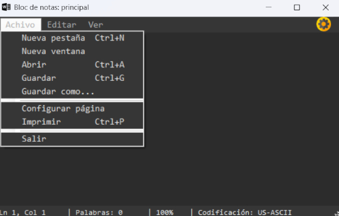
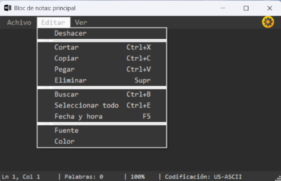
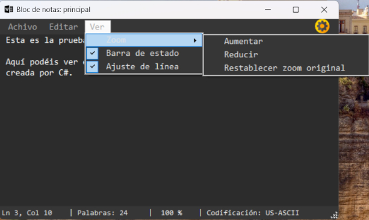

Aplicación de escritorio tipo bloc de notas hecha en C# con Windows Forms.

## 📝 Vista previa de la aplicación

Aquí puedes ver cómo luce la interfaz principal:

Opciones de la barra de tareas desplegadas:

Ventana configuración:

## 🛠️ Tecnologías usadas
- Lenguaje: C#
- Framework: .NET Framework
- IDE: Visual Studio 2022

## 🚀 Cómo ejecutarlo
Abre la solución `.sln` en Visual Studio y ejecuta el proyecto principal.

## ✍️ Autor
Antonio Company – [GitHub](https://github.com/antonicr1986)

