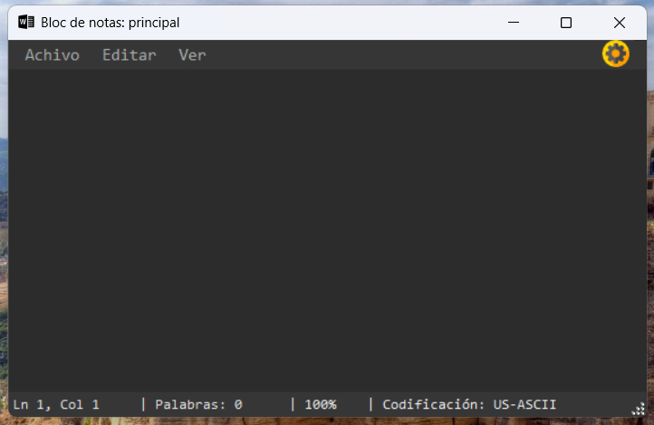
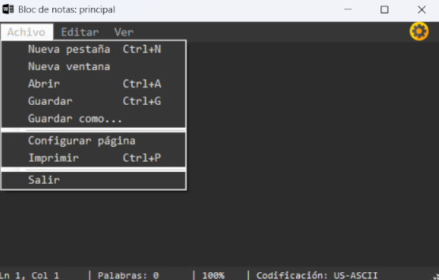
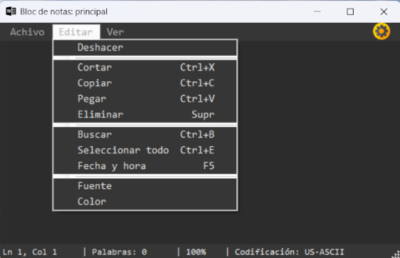
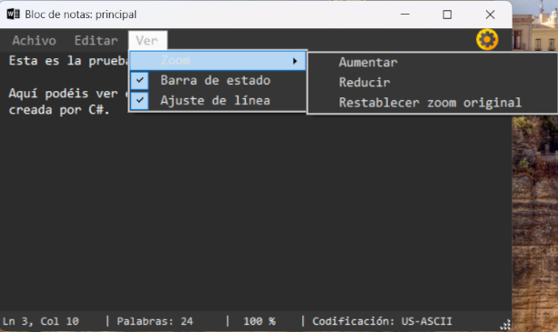
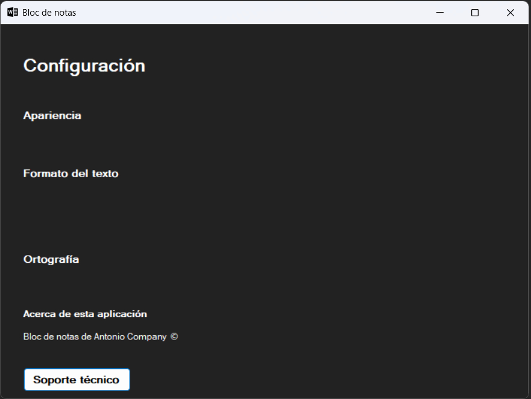

# 📝 Bloc de Notas

Aplicación de escritorio tipo bloc de notas hecha en C# con Windows Forms, con un
aspecto muy similar al Bloc de notas de Windows.

Es un proyecto de práctica: además de la aplicación en sí, tiene montado un
pipeline de integración y entrega continua que compila y publica cada versión
automáticamente.

## ⬇️ Descarga

La última versión está disponible en la sección de Releases, ya compilada:

**[Descargar la última versión](https://github.com/antonicr1986/BlocDeNotas/releases/latest)**

Descarga el `.zip`, descomprímelo y ejecuta `BlocNotasWF.exe`. No necesita
instalación.

> **Aviso de Windows SmartScreen**
>
> Al ejecutarlo puede aparecer *"Windows protegió su PC"*. Es lo normal en
> cualquier ejecutable descargado de internet que no esté firmado con un
> certificado de pago, y este es un proyecto de portfolio sin firmar.
>
> Para continuar: **Más información** → **Ejecutar de todas formas**.
>
> Si prefieres no fiarte, puedes compilarlo tú mismo siguiendo las instrucciones
> de más abajo, o comprobar el hash SHA-256 que GitHub publica junto al `.zip`.

## ✨ Funcionalidades

**Archivo** — Nuevo, Abrir, Guardar, Guardar como, Configurar página, Imprimir

**Edición** — Deshacer, Cortar, Copiar, Pegar, Eliminar, Seleccionar todo,
Buscar, insertar Fecha y hora

**Vista** — Zoom (aumentar, reducir, restablecer al 100%), Ajuste de línea,
Barra de estado

**Pestañas y ventanas** — Varios documentos abiertos a la vez en pestañas, o en
ventanas independientes

**Personalización** — Tema claro y oscuro, tipo y tamaño de fuente, estilo y
color del texto

**Barra de estado** — Línea y columna del cursor, contador de palabras y
codificación del archivo

**Corrector ortográfico** — Requiere tener Microsoft Word instalado (ver
Requisitos)

## 🖼️ Vista previa

Interfaz principal:

Menús de la barra de herramientas:

Ventana de configuración:

## ✅ Requisitos

- Windows
- .NET Framework 4.7.2 (incluido en Windows 10 y 11)
- Microsoft Word — **solo** para el corrector ortográfico. El resto de la
  aplicación funciona sin él.

## 🔨 Compilar desde el código

### Con Visual Studio

Abre `BlocNotasWF.sln` en Visual Studio 2022 y compila con `Ctrl+Shift+B`. Los
paquetes NuGet se restauran solos.

### Desde la línea de comandos

    nuget restore BlocNotasWF.sln
    msbuild BlocNotasWF.sln /p:Configuration=Release

El ejecutable queda en `BlocNotasWF/bin/Release/`.

## ⚙️ CI/CD

El proyecto tiene dos flujos de trabajo en GitHub Actions:

**`ci.yml`** — En cada push y pull request a `master`:

- Compila la solución en un runner de Windows, ya que Windows Forms sobre .NET
  Framework no se puede compilar en Linux
- Restaura los paquetes NuGet, que no están versionados en el repositorio
- Sube el ejecutable compilado como artefacto descargable desde la ejecución

Los commits que solo tocan documentación no lanzan el pipeline, y se puede
ejecutar a mano desde la pestaña Actions cuando hace falta.

**`release.yml`** — Al empujar un tag de versión (`v1.0.1`, `v1.1.0`...):

- Compila la solución
- Empaqueta el ejecutable y sus dependencias en un `.zip`, sin símbolos de
  depuración
- Publica una Release en GitHub con el `.zip` adjunto y las notas generadas a
  partir de los commits desde la versión anterior

Publicar una versión nueva es, por tanto:

    git tag v1.1.0
    git push origin v1.1.0

## 🛠️ Tecnologías

- C# / .NET Framework 4.7.2
- Windows Forms
- Newtonsoft.Json
- Microsoft Office Interop (Word)
- Visual Studio 2022
- GitHub Actions (CI/CD)

## ✍️ Autor

Antonio Company — [GitHub](https://github.com/antonicr1986) ·
[LinkedIn](https://www.linkedin.com/in/antoniocompany/)
